# 멜로디 NFT 가챠 서비스

#### 🎉 프로젝트 소개

멜로디를 NFT화하고 이를 이용해서 작곡, 연주를 해볼 수 있게 하는 서비스입니다. 취업 준비와 학업에 지친 사람들에게 잠시나마 짐을 내려놓고 쉬어갈 수 있게 하는 것이 목표입니다. 

#### 📏 기획 배경

NFT가 화두로 떠오른 지금, 기존 NFT들만의 ‘세계관’이라는 높은 진입장벽을 넘어 누구나 쉽게 접근하고 사용할 수 있는, NFT에 대한 허들을 낮춰보자는 의견에서 시작했습니다. 

#### 🎞 UCC

https://www.youtube.com/watch?v=2ho_VJDKFjg&t=1s

#### 🎵 주요 기능

- 지갑 연결

- 멜로디 NFT 가챠
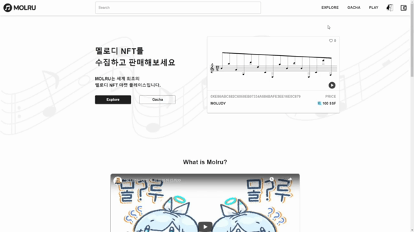

- 발급된 멜로디 재생
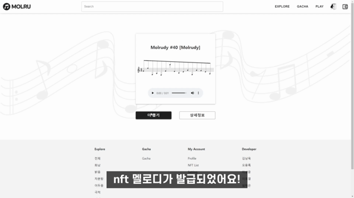

- 멜로디 NFT 추가
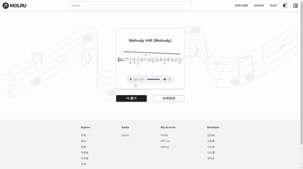

- 멜로디 상세 정보 확인
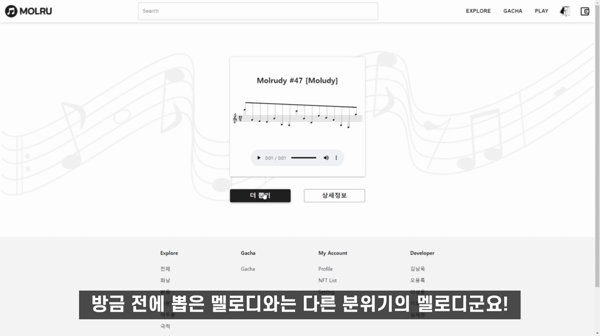

- 마이 페이지
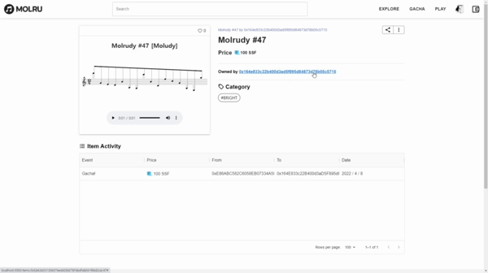

- 프로필 편집
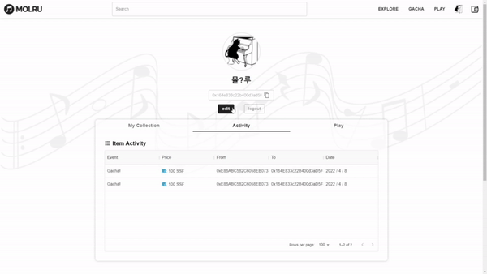

- 멜로디 NFT 조회
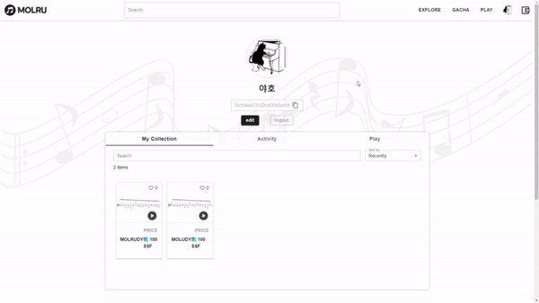

- 멜로디 NFT 카테고리별 조회
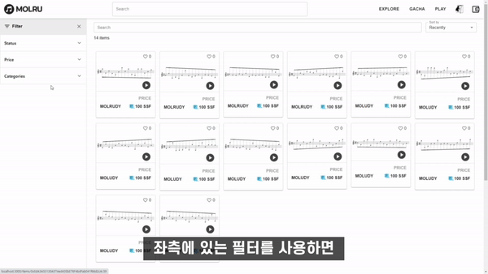

- MolRu 놀이터

#### 🛒 서비스 아키텍처

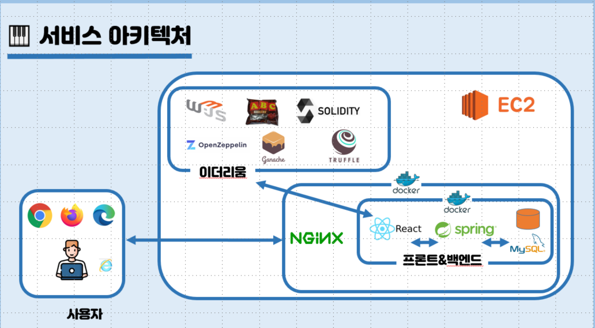

#### 🔧 개발 환경

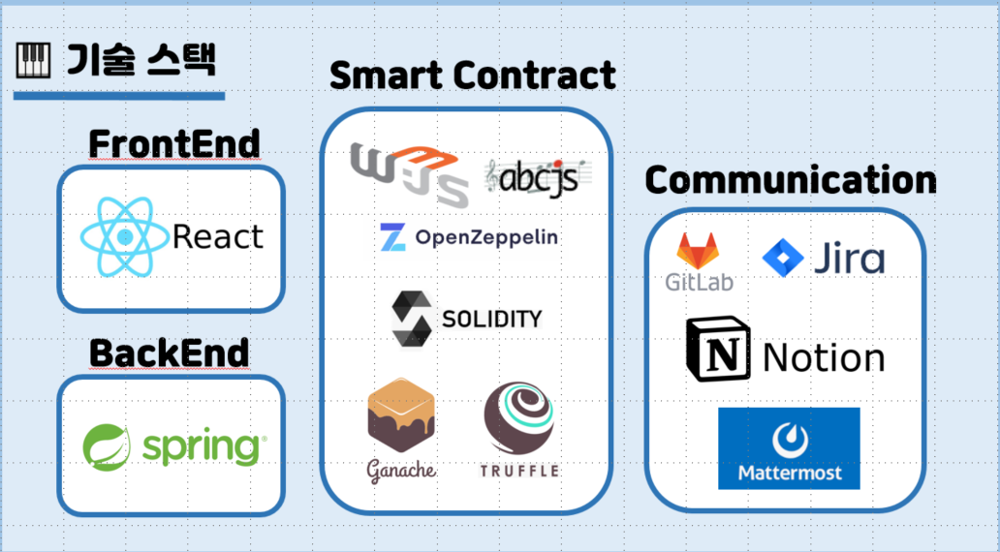

#### 🛠 협업툴

다음과 같은 협업툴을 사용하여 팀워크와 능률을 높이려 노력했습니다.
- Gitlab
- Notion
- Jira

#### ✏ 요구사항 정의서

- google spreadsheet를 활용하여 요구사항 정의서, 기능 명세서를 작성하였습니다.
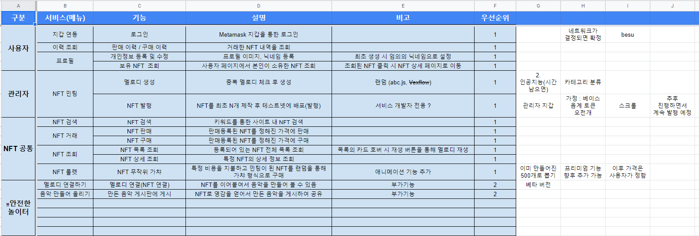
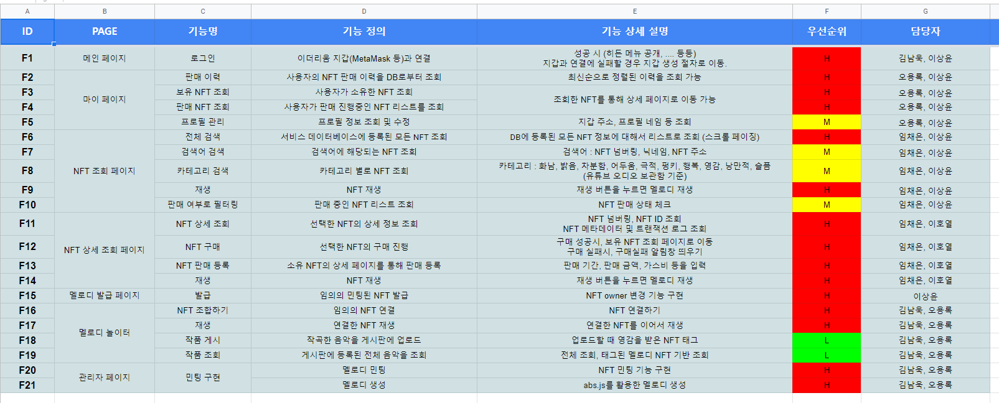

#### 🎨 UI/UX(Figma) : 화면 설계

- Figma를 사용하여 화면을 설계하였습니다.

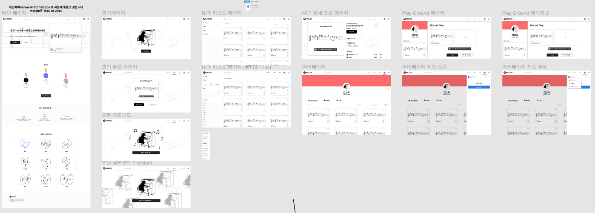

#### 🧱 ERD

- erdcloud를 사용하여 ERD를 설계하였습니다.
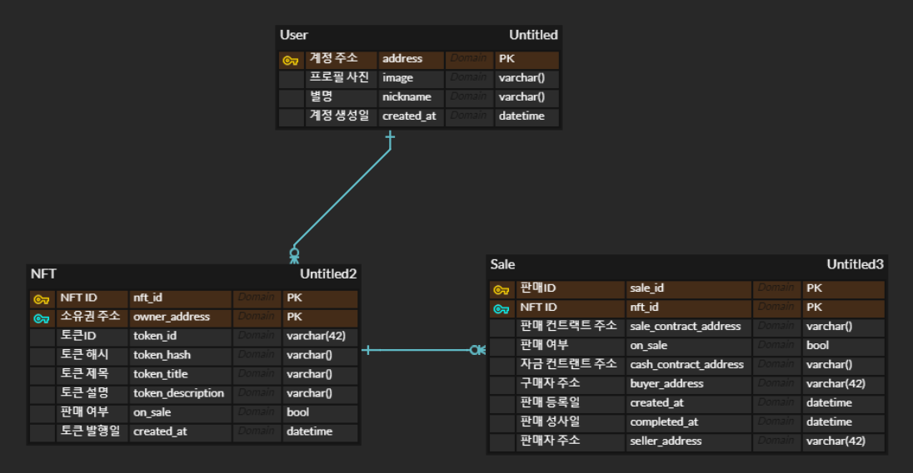

#### 🖇 API

- Postman을 활용하여 API를 설계하였습니다.
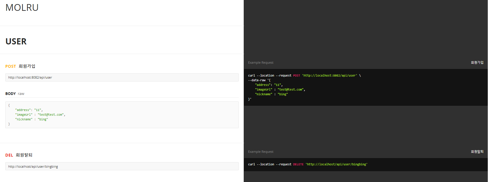
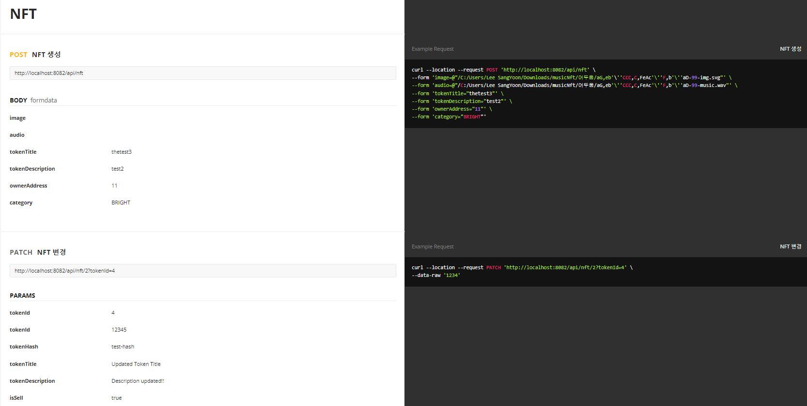
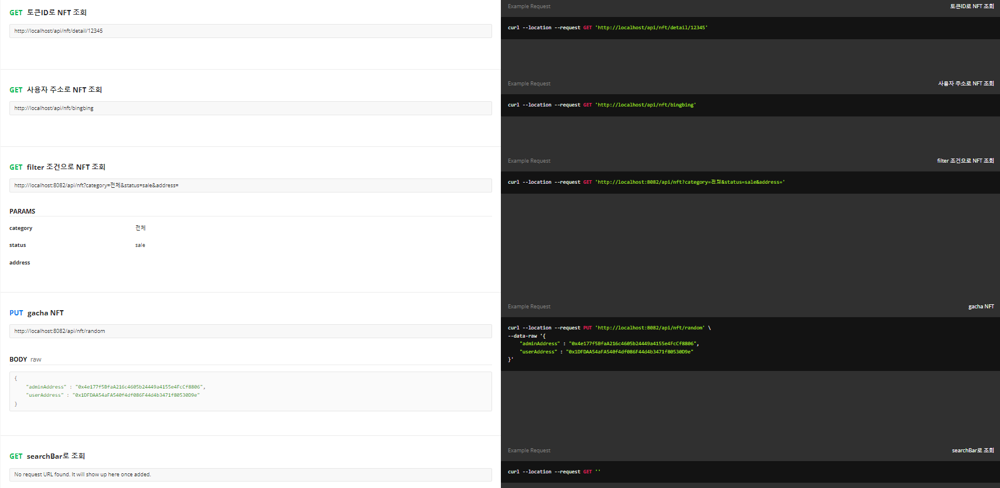
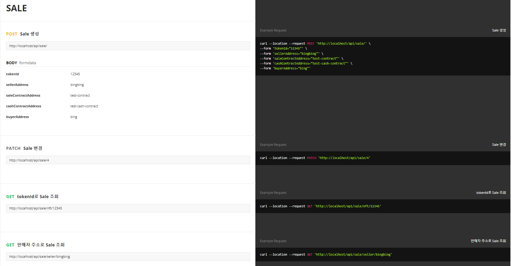

#### 👨‍👧‍👧 팀원 역할

|팀원|역할|한줄 회고|
|:---|:---|:---:|
|김남욱|팀장|못난 팀장이 미안하다 - !|
|오용록|프론트엔드 개발||
|이상윤|백엔드 개발||
|이호열|블록체인 개발||
|임채은|프론트엔드 개발||
